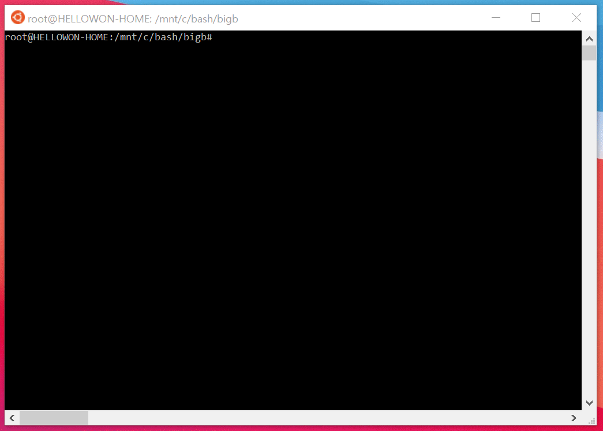

<p align="center">
  
</p>

<p align="center">
  <a href="docs/html/index.html">Documents</a> 
</p>

<p align="center">
Bigb refers to technologies that enable organizations to collect inputs monitored by the security operations team.
</p>


# Overview
In order to respond to intrusion incidents, IT-companies operate an incident response team and establish a 24-hour management system. However, there is a physical limit to human analysis of the collected data.
Bigb can solve these problems.
It overcomes the limitations of physical resources and security equipment required for intrusion analysis with automation and technology.
When human analysis is performed, only a part of the sampled data of the entire log is analyzed, but the system being developed reduces work cost and minimizes human error by conducting full investigation in a mechanical way.
In addition, it is expected that the prevention, control and response of intrusion accidents will be strengthened by correlating current and past data through the analysis model.

### Demo: Dashboard
<p align="center">
  
</p>

### Demo: CLI
<p align="center">
  
</p>

### Demo: Unittest
<p align="center">
  
</p>

# Getting started
## Analze your data
The analyzer runs as a process in the background of the system. The analyzer supports both shell (idle) and background execution. In addition, the analyzer can control the front-end,
When executing in the shell, the progress of the task can be checked

```
$ ./bigb.sh [OPTIONS...]

 -r, --run        Executing shell commands
 -b, --background Executing in the background
 -s, --stop       stop running in the background
 -i, --init       Init data and dashboard
 -u, --unittest   Unittest for customized environments
 
```

For example:

```
$ ./bigb.sh -r
```

## Dashboard
The dashboard consists of a total of 12 tiles. The current security level is expressed as a traffic light. Green means safe, Yellow means caution, and Red means alert. Each state also transitions sequentially from green to yellow and then from yellow to red, but also from green to red.

```
$ ./bigb.sh [OPTIONS...]

 -r, --run        Executing web for debug(default port 80)
 -s, --ssl        Executing web production(default port 443)
 -b, --background Executing web production(default port 80)
 -u, --unittest   Unittest for customized environments
 
```

For example:

```
$ ./run.sh -r
```

## Customize your business
